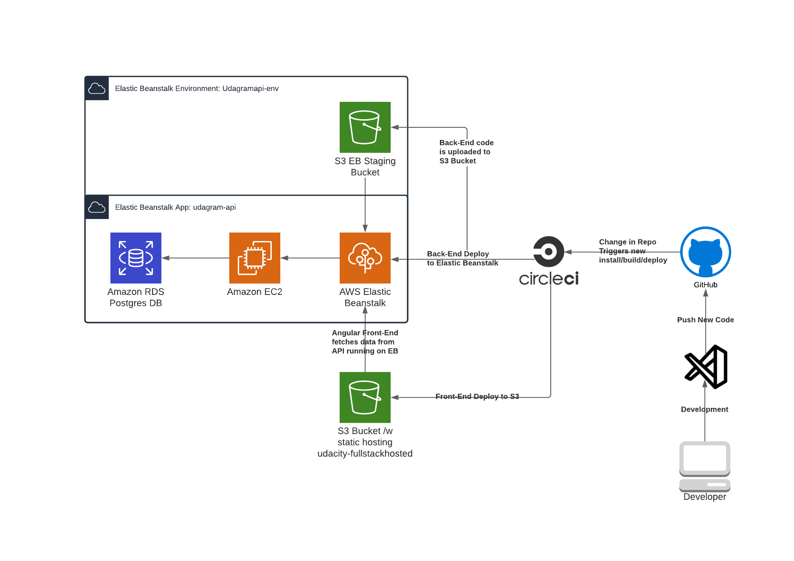

# Preparing source code infrastructure for deployment

## Write code that demonstrates parameterized environment variables

- Environment variables stored in AWS elastic beanstalk configuration of environment udagram-dev under software -> Environment properties settings.
- Variables: 
	- AWS_BUCKET = 
	- AWS_PROFILE = 
	- AWS_REGION = 
	- JWT_SECRET = 
	- URL =   apiHost: 'http://udagram-api-dev.eba-9x5pnrmj.us-east-1.elasticbeanstalk.com//api/v0',


- Environment variables for CI/CD stored in CircleCI Project Settings -> Environment Variables
	- AWS_ACCESS_KEY_ID - IAM user access key for AWScli and elastic beanstalk deployment
	- AWS_SECRET_ACCESS_KEY - Secret for IAM user
	- AWS_BUCKET - S3 Bucket to deploy front-end
	- AWS_REGION

## Write a project-level package.json file and organize it properly

	- Project-level package.json file contains scripts:
		"frontend:install": "cd udagram-frontend && npm install --force",
        "frontend:start": "cd udagram-frontend && npm run start",
        "frontend:build": "cd udagram-frontend && npm run build",
        "frontend:test": "cd udagram-frontend && npm run test",
        "frontend:e2e": "cd udagram-frontend && npm run e2e",
        "frontend:lint": "cd udagram-frontend && npm run lint",
        "frontend:deploy": "cd udagram-frontend && npm run deploy",
        "api:install": "cd udagram-api && npm install .",
        "api:build": "cd udagram-api && npm run build", 
        "api:start": "cd udagram-api && npm run dev",
        "api:deploy": "cd udagram-api && npm install -g typescript && npm run deploy",
        "deploy": "npm run api:deploy && npm run frontend:deploy",
		 "ebPass": "cd udagram-api && eb use udagram-api-dev && eb setenv POSTGRES_HOST=${POSTGRES_HOST} DB_PORT=${DB_PORT} POSTGRES_PASSWORD=${POSTGRES_PASSWORD} POSTGRES_USERNAME=${POSTGRES_USERNAME} POSTGRES_DB=${POSTGRES_DB} JWT_SECRET=${JWT_SECRET} "


## Configure the needed infrastructure for a web application
	
	- RDS Screenshot - 

	- Elastic Beanstalk Screenshot - 

	- S3 Screenshot - 


# Configuring Continuous Integration Pipeline with Github

## Trigger a successful pipeline on each push to the main branch
	- CircleCI Build Status:


	- See screenshot


## Write a proper pipeline file using the config.yml format used by CircleCi

 - See .circleci/config.yml


# Documenting Deployment Process

## Write code that demonstrates a well-organized docs folder

## Prepare an architecture diagram to document the deployment flow
	- Development Pipeline Diagram


	# Udagram

This application is provided to you as an alternative starter project if you do not wish to host your own code done in the previous courses of this nanodegree. The udagram application is a fairly simple application that includes all the major components of a Full-Stack web application.

## Getting Started

1. Clone this repo locally into the location of your choice.
1. Move the content of the udagram folder at the root of the repository as this will become the main content of the project.
1. Open a terminal and navigate to the root of the repo
1. follow the instructions in the installation step

The project can run but is missing some information to connect to the database and storage service. These will be setup during the course of the project

### Dependencies

```
- Node v14.15.1 (LTS) or more recent. While older versions can work it is advisable to keep node to latest LTS version

- npm 6.14.8 (LTS) or more recent, Yarn can work but was not tested for this project

- AWS CLI v2, v1 can work but was not tested for this project

- A RDS database running Postgres.

- A S3 bucket for hosting uploaded pictures.

```

### Installation

Provision the necessary AWS services needed for running the application:

1. In AWS, provision a publicly available RDS database running Postgres. 
1. In AWS, provision a s3 bucket for hosting the uploaded files. 
1. Export the ENV variables needed or use a package like [dotnev](https://www.npmjs.com/package/dotenv)/.
1. From the root of the repo, navigate udagram-api folder `cd starter/udagram-api` to install the node_modules `npm install`. After installation is done start the api in dev mode with `npm run dev`.
1. Without closing the terminal in step 1, navigate to the udagram-frontend `cd starter/udagram-frontend` to intall the node_modules `npm install`. After installation is done start the api in dev mode with `npm run start`.

## Testing

This project contains two different test suite: unit tests and End-To-End tests(e2e). Follow these steps to run the tests.

1. `cd starter/udagram-frontend`
1. `npm run test`
1. `npm run e2e`

There are no Unit test on the back-end

### Unit Tests:

Unit tests are using the Jasmine Framework.

### End to End Tests:

The e2e tests are using Protractor and Jasmine.

## Built With

- [Angular](https://angular.io/) - Single Page Application Framework
- [Node](https://nodejs.org) - Javascript Runtime
- [Express](https://expressjs.com/) - Javascript API Framework

## License

[License](LICENSE.txt)


